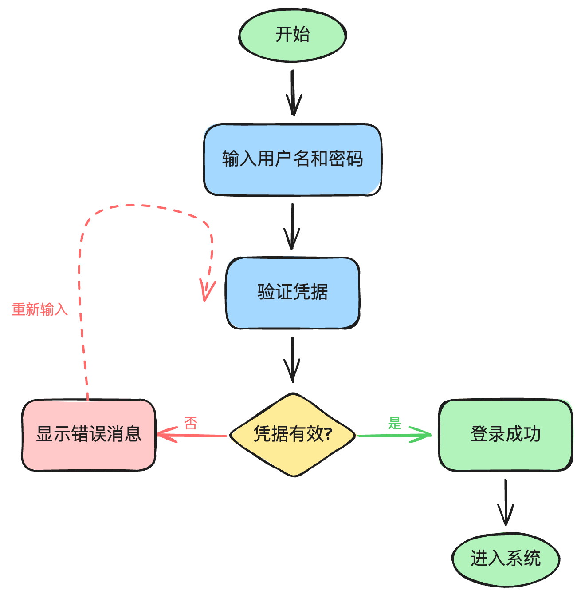
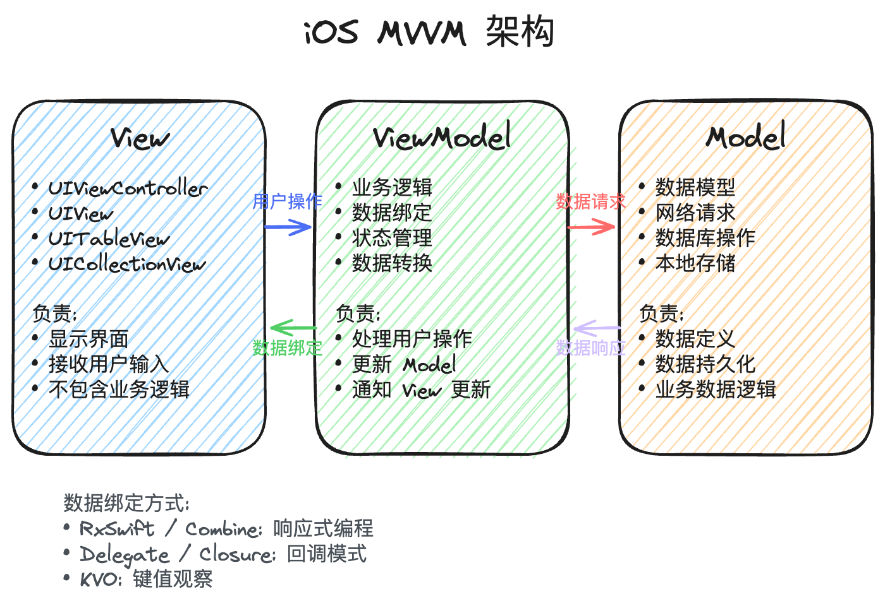
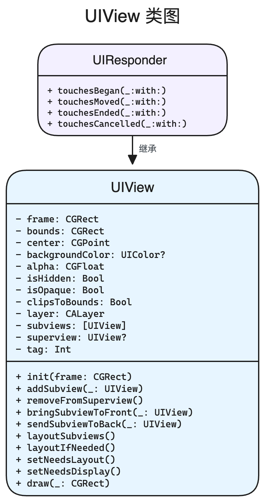
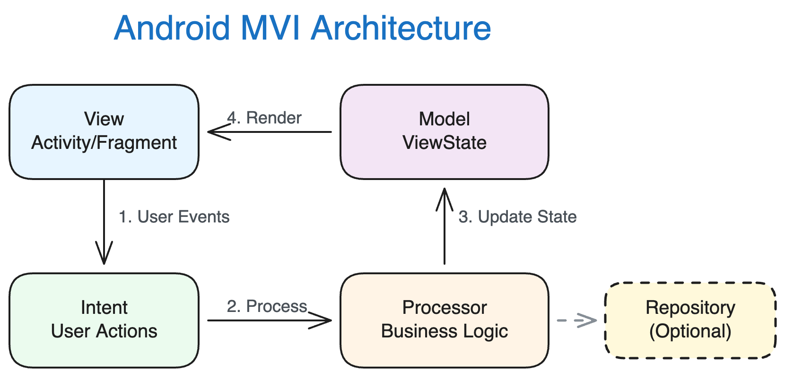

# Excalidraw Generator

A Claude Code skill for generating professional Excalidraw diagrams directly from natural language descriptions. Create beautiful, ready-to-use `.excalidraw` files without manual drawing.

## Features

- **Multiple Diagram Types**: Flowcharts, Architecture Diagrams, UML Class Diagrams, Mind Maps
- **Dual Visual Styles**: Professional mode (clean, polished) and Hand-drawn mode (sketch-style)
- **Smart Layout**: Automatic layout calculation with precise spacing and alignment
- **Direct File Output**: Generates `.excalidraw` files ready to open in Excalidraw
- **Multi-language Support**: Works with both English and Chinese descriptions

## Examples

### Flowchart (User Login Flow)


### Architecture Diagram (iOS MVVM)


### UML Class Diagram (iOS UIView)


### Architecture Diagram (Android MVI)


## Installation

### Method 1: Marketplace (Recommended)

```bash
# Step 1: Add the marketplace
/plugin marketplace add lexiaoyao20/excalidraw-generator

# Step 2: Install the skill
/plugin install excalidraw-generator@excalidraw-generator
```

### Method 2: Manual Installation

1. Clone this repository:
```bash
git clone https://github.com/lexiaoyao20/excalidraw-generator.git
```

2. Copy the skill to your Claude skills directory:
```bash
cp -r excalidraw-generator/skills/excalidraw-generator ~/.claude/skills/
```

3. Restart Claude Code to load the skill.

## Usage

Simply ask Claude to create diagrams using Excalidraw:

### Examples

```
# English
"Create an Excalidraw flowchart for user login process"
"Generate an Excalidraw architecture diagram for microservices"
"Draw an Excalidraw UML class diagram for the Observer pattern"

# Chinese
"用 Excalidraw 画一个用户登录流程图"
"用 Excalidraw 画一个 iOS MVVM 架构图"
"用 Excalidraw 画一个 UIView 的类图"
```

### Style Options

**Professional Mode (Default)**
- Clean, smooth lines with solid fills
- Light background colors for better readability
- Ideal for technical documentation and presentations

**Hand-drawn Mode**
- Sketch-style with rough edges
- Hachure (hatching) fill patterns
- Perfect for brainstorming and informal sharing

To use hand-drawn mode, specify in your request:
```
"用 Excalidraw 画一张手绘风格的流程图"
"Create a hand-drawn style Excalidraw diagram"
```

## Supported Diagram Types

| Type | Description | Use Case |
|------|-------------|----------|
| **Flowchart** | Process flows, decision trees, workflows | Algorithm visualization, business processes |
| **Architecture** | System designs, component diagrams | Software architecture, infrastructure |
| **UML Class** | Class hierarchies, relationships | Object-oriented design |
| **Mind Map** | Concept maps, brainstorming | Ideas exploration, knowledge mapping |

## Opening Generated Files

After Claude generates the `.excalidraw` file:

1. Go to [excalidraw.com](https://excalidraw.com)
2. Click **Open** → **Open from your computer**
3. Select the generated `.excalidraw` file
4. Or simply drag and drop the file into the browser

## Repository Structure

```
excalidraw-generator/
├── .claude-plugin/
│   └── marketplace.json        # Marketplace configuration
├── skills/
│   └── excalidraw-generator/
│       ├── SKILL.md            # Main skill instructions
│       ├── assets/             # Template files
│       │   ├── flowchart-template.json
│       │   ├── architecture-template.json
│       │   ├── uml-class-template.json
│       │   └── mindmap-template.json
│       └── references/
│           └── excalidraw-format.md
├── images/                     # Example screenshots
├── README.md
└── LICENSE
```

## Technical Details

### Layout Calculation

The skill uses precise formulas for layout:

**Text Height:**
```
textHeight = fontSize × 1.25 × numberOfLines
```

**UML Class Container:**
```
containerHeight = headerSection + attributesSection + methodsSection
```

### Color Palettes

**Professional Mode (Light backgrounds):**
- Primary: `#e7f5ff` (light blue)
- Success: `#ebfbee` (light green)
- Warning: `#fff9db` (light yellow)
- Accent: `#f3f0ff` (light purple)

**Hand-drawn Mode (Medium saturation):**
- Primary: `#a5d8ff` (blue)
- Success: `#b2f2bb` (green)
- Warning: `#ffec99` (yellow)
- Accent: `#d0bfff` (purple)

## Contributing

Contributions are welcome! Feel free to:
- Report issues
- Submit pull requests
- Suggest new diagram types or features

## License

MIT License - feel free to use, modify, and distribute.

## Acknowledgments

- Built for [Claude Code](https://claude.ai/code) by Anthropic
- Uses [Excalidraw](https://excalidraw.com) format specification
- Created with the [skill-creator](https://github.com/anthropics/skills) skill
